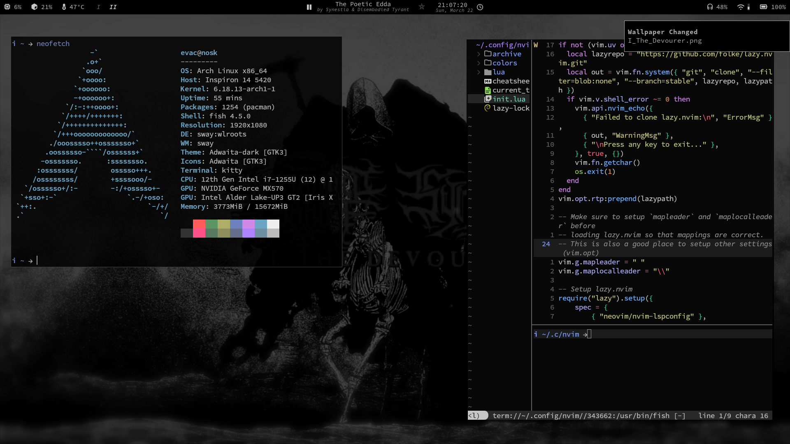
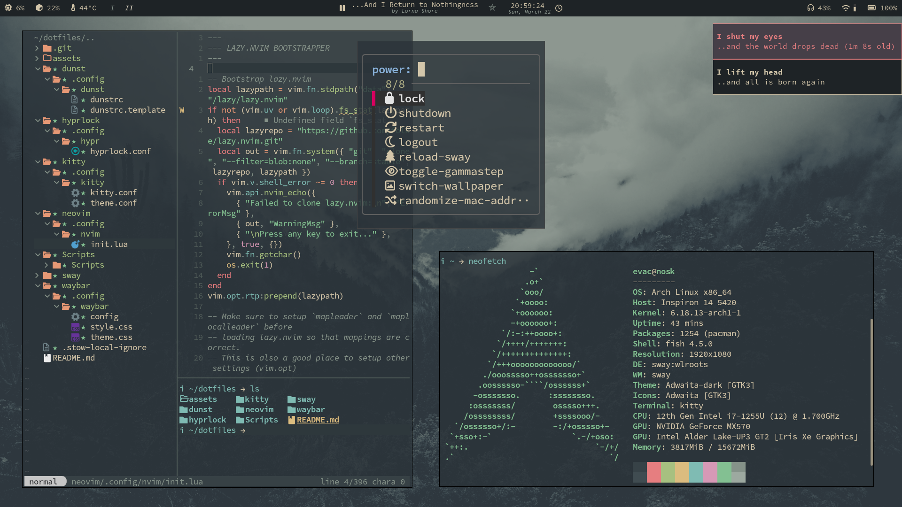

# evacq8's dotfiles

The Linux dotfiles for my setup.
This repo is set up to work with GNU Stow.

## Screenies

| Limbo | Everforest |
| :---: | :---: |
|  |  |

## Info

* Target Distro - Arch Linux (some scripts anticipate you having Arch's pacman)
* Window Manager - Swaywm
* Navigation Bar - Waybar
* Launchers - Kitty + FZF
* Terminal Emulator - Kitty
* Notifications - Dunst
* Lock Screen - Hyprlock
* Editor - Neovim

* Interactive Shell - Fish
* Backend Shell - Bash

* Night light - Gammastep
* Audio Daemon - Pipewire (w/ Pulse Compatibility)

* Font - Source Code Pro
* Colorschemes (so far) - limbo (OLED Black), everforest.
    * Switch themes with `bash ~/Scripts/set_theme.sh theme_name`. Make sure to reopen Kitty and Neovim.

## Setup & Dependencies

TO DO
